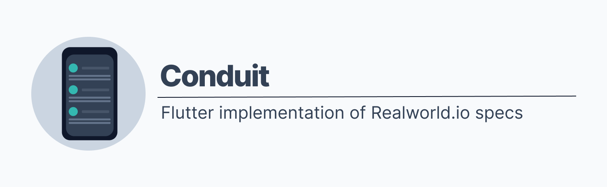
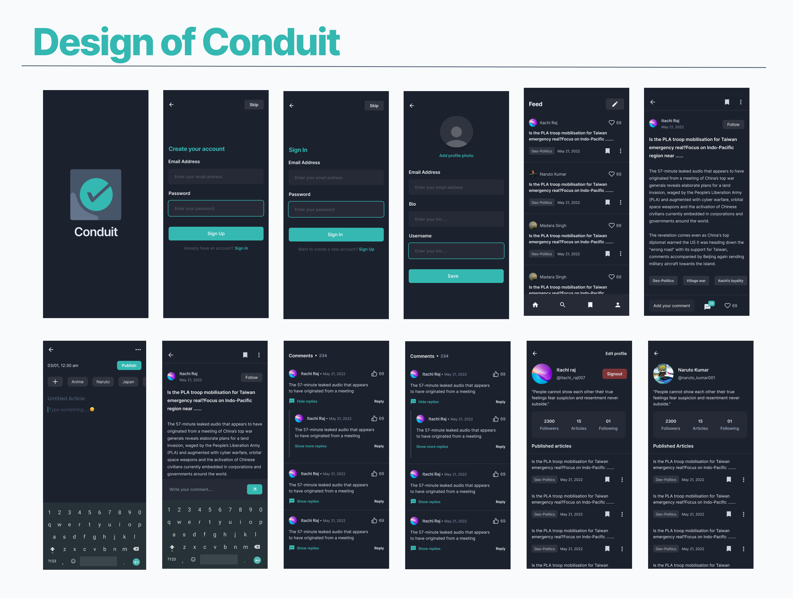

# Conduit

This codebase was created to demonstrate a fully fledged fullstack application built with **Flutter** including CRUD operations, authentication, routing, pagination, and more.

I've gone to great lengths to adhere to the **Flutter** community styleguides & best practices.

For more information on how to this works with other frontends/backends, head over to the [RealWorld](https://github.com/gothinkster/realworld) repo.

## Designing Conduit

Or better, Redesigning conduit. Since there is no official mobile design specification of conduit app, the designs made for mobile were not good enough to show the true potential of Flutter as a UI toolkit. So I went ahead and asked one of friends ([Jatin](https://www.linkedin.com/in/jatin-raj/)) a favor to redesign the app. The frame attached below is the redesigned app.

## TODO

- [ ] Implement date convertor to display date in the format of 12th may, 2022 and not 12/05/2022
